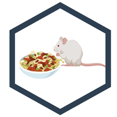

ratPASTA 
======================================================================

<!-- README.md is generated from README.Rmd. Please edit that file -->

R-based Awesome Toolbox for Platform for Acoustic STArtle
=========================================================

<!-- badges: start -->

<!-- badges: end -->

ratPASTA is a package used for processing and visualising data from
startle experiments in rodents or experiments measuring grip strength in
rodents. The input data for this package is created with a PASTA
solution (Platform for Acoustic STArtle), described in detail here:

Virag, D., Homolak, J., Kodvanj, I., Babic Perhoc, A., Knezovic, A.,
Osmanovic Barilar, J., & Salkovic-Petrisic, M. (2020). Repurposing a
digital kitchen scale for neuroscience research: a complete hardware and
software cookbook for PASTA. BioRxiv, 2020.04.10.035766.
<a href="https://doi.org/10.1101/2020.04.10.035766" class="uri">https://doi.org/10.1101/2020.04.10.035766</a>

Using the same platform for measuring grip strength in rodents is
described here:

Homolak, J., Virag, D., Kodvanj, I., Matak, I., Babic Perhoc, A.,
Knezovic, A., Osmanovic Barilar, J., Salkovic-Petrisic, M. (2020).
griPASTA: A hacked kitchen scale for quantification of grip strength in
rodents. BioRxiv, 2020.07.23.217737.
<a href="https://doi.org/10.1101/2020.07.23.217737" class="uri">https://doi.org/10.1101/2020.07.23.217737</a>

Installation
------------

Install ratPASTA from CRAN:

    install.packages("ratPASTA")

…or install ratPASTA from Github:

    install_github("ikodvanj/ratPASTA")

Features
--------

Package includes the following functions:

-   `loadStartleData()` - loads and merges all pasta files (startle
    data)
-   `basicStartlePlot()` - creates a time-series plot
-   `startlePlot()` - returns several plots
-   `summariseStartle()` - returns a mathematical summary of the data
-   `latencyPlot()` - creates a list with two latency plots
-   `loadgriPASTA()` - loads and merges all pasta files (gri strength
    experiments)
-   `griPASTA()` - analysis of grip strength experiments data loaded
    with loadgriPASTA().

Instructions
------------

For instructions on how to use this package read the
[vignette](https://ikodvanj.github.io/ratPASTAsite/articles/ratPASTA.html).
